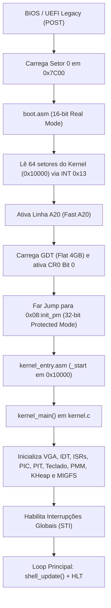

# 💻 migOS — Sistema Operacional Educacional Bare-Metal x86 (IA-32)

> Um sistema operacional monolítico minimalista desenvolvido do zero para a arquitetura **x86 (IA-32 / 32-bit Protected Mode)**, projetado com propósitos acadêmicos e educacionais.

---

## 📋 Sumário
- [Visão Geral](#-visão-geral)
- [Principais Funcionalidades](#-principais-funcionalidades)
- [Arquitetura e Estrutura de Diretórios](#-arquitetura-e-estrutura-de-diretórios)
- [Ciclo de Boot e Mapa de Memória](#-ciclo-de-boot-e-mapa-de-memória)
- [Subsistemas e Drivers](#-subsistemas-e-drivers)
  - [Bootloader (16-bit Real Mode)](#1-bootloader-16-bit-real-mode)
  - [GDT e Modo Protegido de 32-bits](#2-gdt-e-modo-protegido-de-32-bits)
  - [IDT, ISRs e Kernel Panic](#3-idt-isrs-e-kernel-panic)
  - [PIC 8259A (Controlador de Interrupções)](#4-pic-8259a-controlador-de-interrupções)
  - [PIT 8254 Timer (Temporizador de Hardware)](#5-pit-8254-timer-temporizador-de-hardware)
  - [Gerenciador de Memória Física (PMM - Frame Bitmap 4KB)](#6-gerenciador-de-memória-física-pmm---frame-bitmap-4kb)
  - [Alocador de Heap do Kernel (kmalloc / kfree)](#7-alocador-de-heap-do-kernel-kmalloc--kfree)
  - [RAMDisk / MIGFS (Sistema de Arquivos em Memória)](#8-ramdisk--migfs-sistema-de-arquivos-em-memória)
  - [Driver de Vídeo VGA (Modo Texto 80x25)](#9-driver-de-vídeo-vga-modo-texto-80x25)
  - [Driver de Teclado PS/2 e Fila de Eventos](#10-driver-de-teclado-ps2-e-fila-de-eventos)
  - [LibC Minimalista](#11-libc-minimalista)
  - [Shell Interativo migOS](#12-shell-interativo-migos)
- [Comandos Disponíveis](#-comandos-disponíveis)
- [Pré-requisitos e Ferramentas](#-pré-requisitos-e-ferramentas)
- [Compilação e Execução](#-compilação-e-execução)
- [Autor](#-autor)

---

## 🌟 Visão Geral

O **migOS** é um kernel bare-metal de 32 bits escrito em **C (GCC)** e **Assembly (NASM)**. O projeto implementa desde o setor de boot MBR até um terminal de comandos interativo, passando pelo gerenciamento de memória física por bitmap, alocador dinâmico de heap (`kmalloc`/`kfree`), sistema de arquivos em RAM (**RAMDisk / MIGFS**), interrupções, controle de temporização por hardware, renderização em memória de vídeo e decodificação de scancodes do teclado.

O sistema opera de forma independente, sem bibliotecas padrão do sistema operacional hospedeiro (`-ffreestanding`), comunicando-se diretamente com portas de I/O e a memória física da máquina.

---

## ✨ Principais Funcionalidades

- **Bootloader Próprio de 512 bytes (MBR)**: Leitura de 64 setores via BIOS INT 0x13, ativação da Linha A20 e transição Real Mode ➔ Protected Mode.
- **Tabela de Descritores Globais (GDT)**: Segmentação de memória plana de 4 GB para código e dados em Ring 0.
- **Tabela de Descritores de Interrupção (IDT)**: 256 vetores de interrupção configurados com *Interrupt Gates* de 32 bits.
- **Kernel Panic com Dump de Registradores**: Tratamento completo para as 32 exceções nativas da CPU x86 (ISR 0 a 31) com exibição de tela azul de diagnóstico e estado da pilha.
- **Remapeamento de Hardware PIC 8259A**: Cascata Master/Slave com redirecionamento de IRQs 0-15 para os vetores 32-47.
- **PIT 8254 Timer (100 Hz)**: Temporização periódica com suporte a `sleep(ms)`, contador de ticks e cálculo de `uptime`.
- **Gerenciador de Memória Física (PMM)**: Divisão da RAM física em blocos/frames de 4 KB gerenciados por um bitmap de alta performance (`pmm_alloc_block` / `pmm_free_block`).
- **Alocador de Heap Dinâmico (KHeap)**: Gerenciador de memória com suporte a `kmalloc`, `kfree`, `kcalloc` e `krealloc`, com divisão automática de blocos (*block splitting*) e fusão de adjacentes (*coalescing*).
- **RAMDisk / MIGFS (Sistema de Arquivos)**: Sistema de arquivos em memória RAM com suporte a criação, leitura (`cat`), gravação (`write`), deleção (`rm`) e listagem detalhada (`ls`) de arquivos embutidos ou criados em tempo de execução.
- **Driver VGA Text Mode (80x25)**: Escrita direta no framebuffer `0xB8000`, cursor de hardware via portas `0x3D4`/`0x3D5`, rolagem de tela (*scroll*) e paleta de 16 cores.
- **Driver de Teclado PS/2**: Decodificação Scancode Set 1, suporte a teclas especiais (Setas de histórico, Backspace, Enter) e fila assíncrona desacoplada de interrupção.
- **Shell Interativo com Histórico**: Buffer de histórico para repetição de comandos (Setas Cima/Baixo) e utilitários de diagnóstico em tempo real (`meminfo`, `memtest`).
- **Efeito Visual Matrix Code Rain**: Animação em tempo real renderizada com temporização baseada no PIT Timer e saída interativa ao pressionar qualquer tecla.

---

## 📁 Arquitetura e Estrutura de Diretórios

O projeto adota uma estrutura modular e desacoplada, separando código de arquitetura, drivers de dispositivo, gerenciamento de memória, sistema de arquivos, biblioteca C padrão e shell de usuário:

```
MigelSO/
│
├── boot/
│   └── boot.asm                     # Bootloader MBR de 16 bits (Setor 0, carrega 64 setores)
│
├── include/                         # Cabeçalhos do sistema (.h)
│   ├── arch/
│   │   └── i386/
│   │       ├── idt.h                # Estruturas da IDT e ponteiro IDTR
│   │       ├── io.h                 # Primitivas inline de portas I/O (inb, outb, io_wait)
│   │       ├── isr.h                # Estrutura registers_t e declarações de exceções
│   │       ├── pic.h                # Constantes e funções do controlador PIC 8259A
│   │       └── timer.h              # Constantes e funções do PIT 8254 Timer
│   ├── drivers/
│   │   ├── keyboard.h           # Interface do driver de teclado PS/2
│   │   └── vga.h                # Interface do driver de vídeo VGA e cores
│   ├── fs/
│   │   └── migfs.h              # Interface do RAMDisk / MIGFS (Sistema de Arquivos)
│   ├── kernel/
│   │   ├── kernel.h             # Definições centrais do Kernel e versão
│   │   ├── pmm.h                # Gerenciador de Memória Física (PMM 4KB Bitmap)
│   │   └── kheap.h              # Alocador de Heap do Kernel (kmalloc/kfree)
│   ├── libc/
│   │   ├── stdint.h             # Tipos inteiros padrão (uint32_t, size_t, NULL)
│   │   ├── stdlib.h             # Funções utilitárias (rand, srand, itoa)
│   │   └── string.h             # Manipulação de strings e memória (strcmp, memcpy, etc.)
│   └── shell/
│       └── shell.h              # Interface do shell, histórico e fila de comandos
│
├── kernel/                          # Implementação do Kernel e Drivers (.c e .asm)
│   ├── kernel.c                     # Ponto de entrada do Kernel em C (kernel_main)
│   ├── arch/
│   │   └── i386/
│   │       ├── kernel_entry.asm     # Ponto de entrada 32-bit Assembly (_start em 0x10000)
│   │       ├── idt.c                # Inicialização e registro de gates na IDT
│   │       ├── isr_asm.asm          # Stubs Assembly para ISRs (pushal/iret)
│   │       ├── isr.c                # Tratador C de exceções da CPU e Kernel Panic
│   │       ├── pic.c                # Inicialização e envio de EOI ao PIC 8259A
│   │       └── timer.c              # Driver do PIT Timer, rotina IRQ 0 e sleep
│   ├── fs/
│   │   └── migfs.c              # Implementação do RAMDisk / MIGFS e arquivos embutidos
│   ├── memory/
│   │   ├── pmm.c                # Gerenciador de Memória Física (Bitmap 4KB)
│   │   └── kheap.c              # Alocador dinâmico do Heap do Kernel
│   └── drivers/
│       ├── keyboard/
│       │   └── keyboard.c           # Driver de teclado PS/2 (IRQ 1) e buffer
│       └── vga/
│           └── vga.c                # Driver de vídeo texto VGA e hardware cursor
│
├── libc/                            # Biblioteca C Independente (Freestanding)
│   ├── stdlib.c                     # Implementação de rand (Xorshift32) e itoa
│   └── string.c                     # Implementação de strcmp, strncpy, memset, memcpy
│
├── shell/                           # Shell Interativo
│   └── shell.c                      # Interpretador de comandos, histórico, meminfo, fs e Matrix
│
├── build/                           # Artefatos intermediários e imagem final gerada
│   ├── boot.bin
│   ├── kernel.bin
│   ├── kernel_padded.bin
│   ├── *.o
│   └── migOS.img                    # Imagem de disco inicializável
│
├── build.ps1                        # Script PowerShell de build e automação do QEMU
├── linker.ld                        # Script do GNU Linker (Posicionamento em 0x10000)
├── nasm.exe                         # Montador NASM portátil
└── README.md                        # Esta documentação
```

---

## 🗺️ Ciclo de Boot e Mapa de Memória

### 1. Sequência de Inicialização


### 2. Mapa de Memória Física

| Endereço Inicial | Endereço Final | Descrição / Uso |
| :--- | :--- | :--- |
| `0x00000000` | `0x000003FF` | Tabela de Vetores de Interrupção Real Mode (IVT da BIOS) |
| `0x00007C00` | `0x00007DFF` | Setor de Boot MBR (`boot.bin` - 512 bytes) |
| `0x00009000` | `0x0000FFFF` | Pilha Inicial do Sistema (*Stack Base* em `0x90000`) |
| `0x00010000` | `0x0001FFFF` | **Kernel migOS** carregado na memória (`_start` em `0x10000`) |
| `0x000B8000` | `0x000B8F9F` | Framebuffer da Memória de Vídeo VGA (Texto 80x25, 2 bytes/char) |
| `0x00100000` | `0x001FFFFF` | **Memória Estendida Livre (PMM)**: Frames de 4KB gerenciados pelo PMM |
| `0x00200000` | `0x002FFFFF` | **Heap Dinâmico do Kernel (KHeap)**: 1 MB inicial para `kmalloc` e buffers do **MIGFS** |

---

## ⚙️ Subsistemas e Drivers

### 1. Bootloader (16-bit Real Mode)
- **Arquivo**: [`boot/boot.asm`](file:///C:/Users/Miguel/Documents/Faculdade%20-%202026/Materia%20Sistemas/MigelSO/boot/boot.asm)
- Configura registradores de segmento, pilha, lê 64 setores do disco (32 KB) a partir do setor 2 usando `INT 0x13, AH=0x02`, ativa a Linha A20 e salta para o modo protegido de 32 bits.

### 2. GDT e Modo Protegido de 32-bits
- GDT plana com descritores Nulo (`0x00`), Código do Kernel (`0x08`) e Dados do Kernel (`0x10`) abrangendo 4 GB em Ring 0.

### 3. IDT, ISRs e Kernel Panic
- **Arquivos**: [`kernel/arch/i386/idt.c`](file:///C:/Users/Miguel/Documents/Faculdade%20-%202026/Materia%20Sistemas/MigelSO/kernel/arch/i386/idt.c), [`kernel/arch/i386/isr.c`](file:///C:/Users/Miguel/Documents/Faculdade%20-%202026/Materia%20Sistemas/MigelSO/kernel/arch/i386/isr.c), [`kernel/arch/i386/isr_asm.asm`](file:///C:/Users/Miguel/Documents/Faculdade%20-%202026/Materia%20Sistemas/MigelSO/kernel/arch/i386/isr_asm.asm)
- Tabela de 256 entradas com captura das 32 exceções de CPU e tela de **Kernel Panic** com dump completo de registradores.

### 4. PIC 8259A (Controlador de Interrupções)
- **Arquivo**: [`kernel/arch/i386/pic.c`](file:///C:/Users/Miguel/Documents/Faculdade%20-%202026/Materia%20Sistemas/MigelSO/kernel/arch/i386/pic.c)
- Remapeamento dos vetores para 32-47, habilitando **IRQ 0 (Timer)** e **IRQ 1 (Teclado)**.

### 5. PIT 8254 Timer (Temporizador de Hardware)
- **Arquivo**: [`kernel/arch/i386/timer.c`](file:///C:/Users/Miguel/Documents/Faculdade%20-%202026/Materia%20Sistemas/MigelSO/kernel/arch/i386/timer.c)
- Frequência de `100 Hz` (10ms por tick). Temporização precisa com suporte a `sleep(ms)` via `hlt` e cálculo de `uptime`.

### 6. Gerenciador de Memória Física (PMM - Frame Bitmap 4KB)
- **Arquivos**: [`include/kernel/pmm.h`](file:///C:/Users/Miguel/Documents/Faculdade%20-%202026/Materia%20Sistemas/MigelSO/include/kernel/pmm.h), [`kernel/memory/pmm.c`](file:///C:/Users/Miguel/Documents/Faculdade%20-%202026/Materia%20Sistemas/MigelSO/kernel/memory/pmm.c)
- Divisão da RAM física em frames de 4 KB com mapa de bits (`0 = livre`, `1 = ocupado`). Blindagem do primeiro 1 MB de memória física.
- Fornece: `pmm_alloc_block()`, `pmm_free_block()`, `pmm_alloc_blocks(count)` e `pmm_free_blocks()`.

### 7. Alocador de Heap do Kernel (kmalloc / kfree)
- **Arquivos**: [`include/kernel/kheap.h`](file:///C:/Users/Miguel/Documents/Faculdade%20-%202026/Materia%20Sistemas/MigelSO/include/kernel/kheap.h), [`kernel/memory/kheap.c`](file:///C:/Users/Miguel/Documents/Faculdade%20-%202026/Materia%20Sistemas/MigelSO/kernel/memory/kheap.c)
- Alocador dinâmico por lista encadeada com cabeçalhos [`kheap_block_t`](file:///C:/Users/Miguel/Documents/Faculdade%20-%202026/Materia%20Sistemas/MigelSO/include/kernel/kheap.h#L12-L18) (`0x1A2B3C4D`), *First-Fit*, *block splitting*, *coalescing* e expansão dinâmica via PMM.
- Fornece: `kmalloc(size)`, `kfree(ptr)`, `kcalloc(num, size)` e `krealloc(ptr, new_size)`.

### 8. RAMDisk / MIGFS (Sistema de Arquivos em Memória)
- **Arquivos**: [`include/fs/migfs.h`](file:///C:/Users/Miguel/Documents/Faculdade%20-%202026/Materia%20Sistemas/MigelSO/include/fs/migfs.h), [`kernel/fs/migfs.c`](file:///C:/Users/Miguel/Documents/Faculdade%20-%202026/Materia%20Sistemas/MigelSO/kernel/fs/migfs.c)
- Virtual File System em RAM para armazenamento e manipulação de arquivos com alocação dinâmica no Heap (`kmalloc`).
- Carrega automaticamente no boot arquivos embutidos no sistema (`readme.txt`, `kernel.c`, `hello.txt`, `system.cfg`, `secret.txt`).
- Suporte a atributos de proteção (`[RO]` somente leitura e `[RW]` leitura/escrita).
- Fornece: `migfs_create()`, `migfs_open()`, `migfs_read()`, `migfs_write()`, `migfs_append()`, `migfs_delete()`.

### 9. Driver de Vídeo VGA (Modo Texto 80x25)
- **Arquivo**: [`kernel/drivers/vga/vga.c`](file:///C:/Users/Miguel/Documents/Faculdade%20-%202026/Materia%20Sistemas/MigelSO/kernel/drivers/vga/vga.c)
- Framebuffer linear em `0xB8000`, caracteres de controle (`\n`, `\r`, `\b`), cursor físico via portas `0x3D4`/`0x3D5` e rolagem de tela.

### 10. Driver de Teclado PS/2 e Fila de Eventos
- **Arquivo**: [`kernel/drivers/keyboard/keyboard.c`](file:///C:/Users/Miguel/Documents/Faculdade%20-%202026/Materia%20Sistemas/MigelSO/kernel/drivers/keyboard/keyboard.c)
- Decodifica Scancode Set 1, gerencia histórico e posta comandos de forma assíncrona para execução fora da ISR (`IF = 1`).

### 11. LibC Minimalista
- **Arquivos**: [`libc/string.c`](file:///C:/Users/Miguel/Documents/Faculdade%20-%202026/Materia%20Sistemas/MigelSO/libc/string.c), [`libc/stdlib.c`](file:///C:/Users/Miguel/Documents/Faculdade%20-%202026/Materia%20Sistemas/MigelSO/libc/stdlib.c), [`include/libc/stdint.h`](file:///C:/Users/Miguel/Documents/Faculdade%20-%202026/Materia%20Sistemas/MigelSO/include/libc/stdint.h)
- Primitivas padrão `strcmp`, `strncmp`, `strcpy`, `strncpy`, `strlen`, `memset`, `memcpy`, `itoa` e **Xorshift32**.

### 12. Shell Interativo migOS
- **Arquivo**: [`shell/shell.c`](file:///C:/Users/Miguel/Documents/Faculdade%20-%202026/Materia%20Sistemas/MigelSO/shell/shell.c)
- Prompt `migOS>`, histórico de comandos (Setas), comandos de arquivos (`ls`, `cat`, `touch`, `write`, `rm`), diagnósticos e Matrix.

---

## 💻 Comandos Disponíveis

| Comando | Descrição |
| :--- | :--- |
| `help` | Exibe a lista completa de comandos disponíveis e sua sintaxe. |
| `clear` | Limpa o buffer de vídeo VGA e reposiciona o cursor no canto superior esquerdo `(0, 0)`. |
| `ls` | Lista todos os arquivos presentes no **RAMDisk (MIGFS)** com nome, tamanho e atributos `[RO]/[RW]`. |
| `cat <arquivo>` | Exibe o conteúdo de texto de um arquivo na tela. |
| `touch <arquivo>` | Cria um novo arquivo vazio no RAMDisk. |
| `write <arq> <texto>` | Grava uma linha de texto diretamente no arquivo especificado. |
| `rm <arquivo>` | Remove um arquivo do RAMDisk (arquivos `[RO]` são protegidos). |
| `meminfo` | Exibe em tempo real as estatísticas de memória física (**PMM**) e do Heap do Kernel (**kmalloc**). |
| `memtest` | Executa teste de integridade com alocação e liberação dinâmica no PMM e KHeap. |
| `uptime` | Exibe o tempo de atividade do sistema em segundos e a contagem total de ticks do PIT Timer. |
| `matrix` | Inicia a animação digital **Matrix Code Rain** com caracteres em tons verdes. Pressione qualquer tecla para sair. |
| `version` | Exibe a versão atual do Kernel (`v0.5`) e arquitetura de execução. |
| `about` | Exibe informações sobre o projeto, arquitetura x86 e autor. |
| `panic` | Dispara intencionalmente uma exceção de CPU (Divisão por Zero / `int $0`) para demonstrar o **Kernel Panic**. |
| `reboot` | Reinicia a máquina virtual com comando de hardware via controlador de teclado (`0x64`) e Triple Fault forçado. |

---

## 🛠️ Pré-requisitos e Ferramentas

Para compilar e executar o **migOS** no ambiente Windows, são necessárias as seguintes ferramentas:

1. **w64devkit (GCC & GNU Binutils 32-bit)**:
   - `gcc` (com suporte à flag `-m32` freestanding)
   - `ld` (GNU Linker com suporte a `-m i386pe`)
   - `objcopy` (extração de binário puro)
   - Caminho padrão recomendado: `C:\w64devkit\bin` (reconhecido automaticamente pelo script de build).
2. **NASM (Netwide Assembler)**:
   - Binário `nasm.exe` (já incluso na raiz do repositório).
3. **QEMU Emulator**:
   - `qemu-system-x86_64` ou `qemu-system-i386`.
   - Caminho padrão recomendado: `C:\Program Files\qemu\`.
4. **PowerShell**:
   - PowerShell 5.1 ou superior (nativo no Windows).

---

## 🚀 Compilação e Execução

Todo o processo de compilação, linkagem, padding de setores e execução no emulador é automatizado pelo script [`build.ps1`](file:///C:/Users/Miguel/Documents/Faculdade%20-%202026/Materia%20Sistemas/MigelSO/build.ps1).

### 1. Compilar e Iniciar no QEMU
Abra o PowerShell na raiz do projeto e execute:
```powershell
.\build.ps1
```

### 2. Apenas Compilar (Sem Iniciar o QEMU)
Gera a imagem de disco `migOS.img` na pasta `build/` e na raiz:
```powershell
.\build.ps1 -NoRun
```

### 3. Limpeza de Artefatos de Compilação
Remove todos os arquivos `.o`, `.bin`, `.tmp` e `.img`:
```powershell
.\build.ps1 -Clean
```

---

## 👨‍💻 Autor

- **Autor**: Miguel Gonçalves
- **Curso**: Faculdade / Matéria de Sistemas Operacionais (2026)
- **Repositório**: `miguelGoncalvss/MigSO`

---
*migOS — Desenvolvido com carinho para explorar os fundamentos da computação de baixo nível e arquitetura de computadores.*
