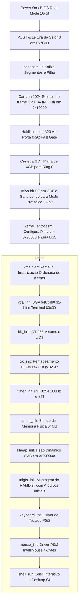
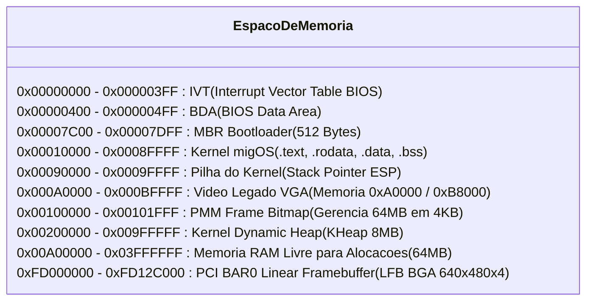
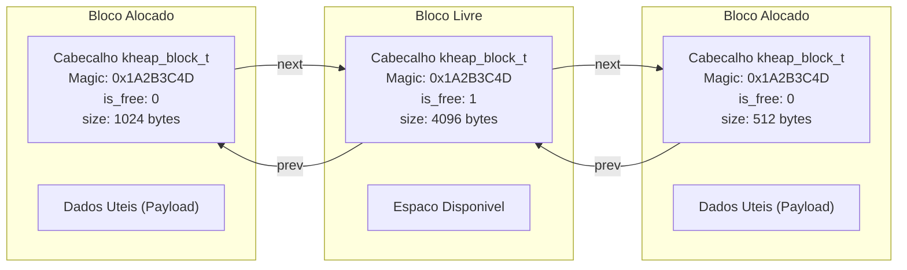
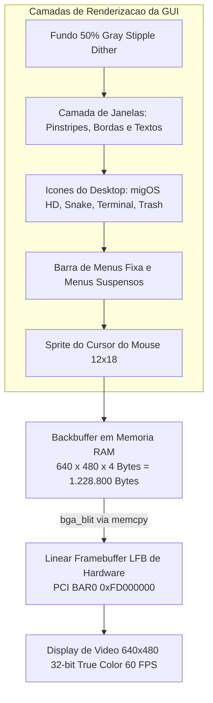
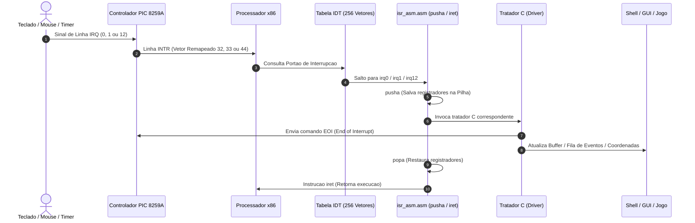

# migOS - Sistema Operacional Educacional Bare-Metal x86 (IA-32)

Sistema operacional monolitico de 32 bits desenvolvido do zero para a arquitetura x86 (IA-32 / Protected Mode), projetado para fins academicos, explorando os fundamentos de software de sistema, drivers de hardware, gerenciamento de memoria fisica e virtual, sistema de arquivos em RAM, interface grafica retro no estilo Mac OS System 7 em alta resolucao 640x480 (32-bit True Color) e execucao de aplicacoes bare-metal.

---

## Indice

- [Visao Geral](#visao-geral)
- [Mapa Mental da Arquitetura](#mapa-mental-da-arquitetura)
- [Principais Funcionalidades](#principais-funcionalidades)
- [Estrutura do Projeto](#estrutura-do-projeto)
- [Detalhamento Arquivo por Arquivo](#detalhamento-arquivo-por-arquivo)
  - [1. Arquivos da Raiz e Automacao](#1-arquivos-da-raiz-e-automacao)
  - [2. Bootloader](#2-bootloader)
  - [3. Arquitetura i386 e Hardware](#3-arquitetura-i386-e-hardware)
  - [4. Nucleo do Kernel](#4-nucleo-do-kernel)
  - [5. Gerenciamento de Memoria](#5-gerenciamento-de-memoria)
  - [6. Drivers de Dispositivos](#6-drivers-de-dispositivos)
  - [7. Sistema de Arquivos (MIGFS / RAMDisk)](#7-sistema-de-arquivos-migfs--ramdisk)
  - [8. Biblioteca C Minimalista (Freestanding LibC)](#8-biblioteca-c-minimalista-freestanding-libc)
  - [9. Shell Interativo](#9-shell-interativo)
  - [10. Interface Grafica (GUI Mac OS System 7 640x480)](#10-interface-grafica-gui-mac-os-system-7-640x480)
  - [11. Jogos e Aplicacoes](#11-jogos-e-aplicacoes)
- [Ciclo de Inicializacao (Boot Flow)](#ciclo-de-inicializacao-boot-flow)
- [Mapa de Memoria Fisica](#mapa-de-memoria-fisica)
- [Arquitetura do Heap Dinamico (KHeap)](#arquitetura-do-heap-dinamico-kheap)
- [Pipeline Grafico e Double Buffering](#pipeline-grafico-e-double-buffering)
- [Fluxo de Interrupcoes e Drivers de Entrada](#fluxo-de-interrupcoes-e-drivers-de-entrada)
- [Comandos do Terminal](#comandos-do-terminal)
- [Requisitos e Compilacao](#requisitos-e-compilacao)
- [Autor](#autor)

---

## Visao Geral

O migOS e um kernel bare-metal de 32 bits escrito em C (padrao GNU99 freestanding) e Assembly x86 (NASM). O projeto implementa desde o setor de inicializacao MBR de 512 bytes ate um terminal interativo com historico e um ambiente grafico retro inspirado no classico **Mac OS System 7 (1991)** padronizado na resolucao de **640x480 pixels a 32-bit True Color (ARGB/XRGB)**, passando por gerenciamento de memoria fisica baseado em mapa de bits (PMM Frame Bitmap 4KB), alocador dinamico de memoria no Heap (KHeap com coalescencia e divisao de blocos), sistema de arquivos em memoria RAM (RAMDisk / MIGFS), controle de interrupcoes por hardware (IDT e PIC 8259A), temporizacao precisa por hardware (PIT 8254), driver de video Bochs/QEMU BGA com deteccao dinamica de barramento PCI e Linear Framebuffer (LFB), suporte a teclado e mouse PS/2 com roda de rolagem, biblioteca C freestanding e jogos integrados (Snake Game).

O kernel nao utiliza qualquer biblioteca padrao do sistema hospedeiro (`-ffreestanding -fno-builtin`), operando diretamente sobre o hardware x86 atraves de instrucoes de maquina e portas de entrada/saida (I/O Ports).

---

## Principais Funcionalidades

- Bootloader MBR proprio de 512 bytes com leitura LBA por pacotes DAP em blocos de 64 setores (INT 0x13 AH=0x42), ativacao da Linha A20 e transicao para Modo Protegido de 32 bits.
- Segmentacao plana (Flat Memory Model) de 4 GB para codigo e dados em Ring 0 via Global Descriptor Table (GDT).
- Tabela de Descritores de Interrupcao (IDT) com 256 vetores e tratadores para as 32 excecoes nativas da CPU x86 (ISRs 0 a 31).
- Kernel Panic com tela de diagnostico, dump completo dos registradores de execucao (EIP, CS, EFLAGS, EAX, EBX, ECX, EDX, ESP, EBP, ESI, EDI), contagem regressiva em tempo real sincronizada via hardware e rotina de reinicializacao automatica (Triple Fault forcado / Fast Reset).
- Remapeamento dos controladores de interrupcao PIC 8259A Master/Slave (IRQs 0-15 redirecionados para vetores 32-47).
- Temporizacao periodica em 100 Hz gerada pelo Programmable Interval Timer (PIT 8254), fornecendo medicoes de tempo de atividade (uptime em segundos e milissegundos) e rotinas de espera (`sleep` e `timer_wait`) sincronizadas com a instrucao `hlt`.
- Gerenciador de Memoria Fisica (PMM) com granularidade de frames de 4 KB gerenciados por mapa de bits (bitmap), protegendo o primeiro 1 MB de memoria fisica e fornecendo alocacao contigua de blocos.
- Alocador dinamico de memoria do Kernel (KHeap / kmalloc, kfree, kcalloc, krealloc) baseado em lista duplamente encadeada com cabecalhos protegidos por assinatura magica (0x1A2B3C4D), politica First-Fit, divisao automatica de blocos (splitting), fusao de blocos livres adjacentes (coalescing) e autoexpansao sob demanda via PMM.
- Sistema de Arquivos em RAM (MIGFS / RAMDisk) para manipulacao dinamica de arquivos em memoria, com protecao por flags (somente leitura / leitura e escrita) e persistencia em tempo de execucao.
- Driver Grafico Bochs/QEMU BGA (Bochs Graphics Adapter) com leitura dinamica do barramento PCI para identificacao do endereco base do Linear Framebuffer (BAR0) e configuracao de modos de video de alta resolucao em 32-bit True Color.
- Terminal CLI em Alta Resolucao (640x480):
  - 80 colunas por 30 linhas de texto com fonte bitmap 8x16 de alta nitidez.
  - Buffer circular retroativo de 300 linhas de historico.
  - Navegacao de historico via roda do mouse ou Page Up / Page Down.
  - Cursor visual e espelhamento serial instantaneo via porta COM1 (0x3F8).
  - Decodificador e transliterador de caracteres acentuados UTF-8 para a tabela IBM CP437.
- Interface Grafica Retro Mac OS System 7 Classic (640x480 @ 32-bit True Color):
  - Fundo pontilhado dithered 50% Gray Stipple.
  - Barra de menus superior fixa com logo do migOS, menus suspensos interativos ("migOS", "File", "Edit", "View", "Special", "Help") e relogio de uptime em tempo real.
  - Janelas amplas com estetica Platinum, barras de titulo com pinstripes horizontais, botao quadrado de fechar (Go-Away Box), sombra projetada e arraste suave com o mouse.
  - Janela de Perfil do Sistema ("System Profile" 460x340 px) com estatisticas detalhadas de hardware e memoria.
  - Janela do Gerenciador de Arquivos ("migOS HD" 430x300 px) com listagem detalhada de arquivos do RAMDisk.
  - Icones interativos no Desktop ("migOS HD", "Snake", "Terminal", "Trash") com suporte a selecao e duplo-clique para abrir janelas ou lancar aplicativos diretamente.
  - Sprite classico do cursor do mouse System 7 renderizado suavemente no backbuffer antes da transferencia grafica.
- Driver de Teclado PS/2 com decodificacao de scancodes Set 1, teclas estendidas (0xE0), buffer de edicao no terminal, historico de comandos e fila assincrona circular de eventos (press/release) para aplicacoes graficas e jogos.
- Driver de Mouse PS/2 com deteccao e ativacao de protocolo IntelliMouse (roda de scroll integrada), delimitacao de bordas de tela personalizavel (0..639 e 0..479), decodificacao de pacotes de 3 ou 4 bytes no IRQ 12 e integracao direta tanto na rolagem do terminal quanto no ambiente grafico GUI.
- Biblioteca C Freestanding com implementacao completa de operacoes com memoria (`memset`, `memcpy`, `memmove`, `memcmp`), strings (`strcmp`, `strncmp`, `strcasecmp`, `strcpy`, `strncpy`, `strcat`, `strlen`, `strchr`, `strstr`, `strdup`, `strupr`), formatacao de texto (`printf`, `sprintf`, `snprintf`, `vsnprintf`, `sscanf`), utilitarios (`atoi`, `atol`, `strtol`, `itoa`, `qsort`, `rand`, `srand`) e rotinas aritmeticas para inteiros de 64 bits.
- Shell de comandos interativo desacoplado da rotina de interrupcao, historico de comandos navegavel com setas Cima/Baixo, utilitarios de inspecao de memoria em tempo real (`meminfo`, `memtest`), tempo de atividade (`uptime`), gerenciamento de arquivos (`ls`, `cat`, `touch`, `write`, `rm`), efeito visual Matrix Code Rain e lancadores (`gui`, `desktop`, `snake`).
- Jogo da Cobrinha (Snake Game) integrado nativamente com arena ampliada (60x24), controle de velocidade progressiva por pontuacao, frutas bonus temporizadas, persistencia de recorde e tela de Game Over.

---

## Estrutura do Projeto

```
MigelSO/
│
├── .gitignore                       # Configuracao de exclusao de artefatos do controle de versao
├── README.md                        # Documentacao tecnica completa do projeto
├── build.ps1                        # Script de automacao de compilacao, linkagem, imagem e emulacao
├── linker.ld                        # Script do GNU Linker para posicionamento do Kernel em 0x10000
├── nasm.exe                         # Montador NASM portatil para ambiente Windows
│
├── boot/                            # Codigo do setor de inicializacao MBR
│   └── boot.asm                     # Bootloader em Assembly x86 16-bit Real Mode (512 bytes)
│
├── include/                         # Arquivos de cabecalho e interfaces publicas (.h)
│   ├── arch/                        # Cabecalhos de arquitetura do processador
│   │   └── i386/
│   │       ├── idt.h                # Estruturas da Interrupt Descriptor Table e ponteiro IDTR
│   │       ├── io.h                 # Primitivas inline de portas de I/O (inb, outb, inw, outw, inl, outl, io_wait)
│   │       ├── isr.h                # Estrutura de salvamento de contexto registers_t e ISRs
│   │       ├── pic.h                # Constantes e funcoes do controlador PIC 8259A
│   │       ├── reboot.h             # Rotina de reinicializacao por hardware e Triple Fault
│   │       └── timer.h              # Constantes e funcoes do temporizador PIT 8254
│   │
│   ├── drivers/                     # Cabecalhos dos drivers de dispositivos
│   │   ├── ata.h                    # Interface do driver de disco rígido ATA / IDE PIO
│   │   ├── bga.h                    # Interface do adaptador grafico Bochs/QEMU BGA (640x480 32-bit)
│   │   ├── keyboard.h               # Interface do driver de teclado PS/2
│   │   ├── mouse.h                  # Interface do driver de mouse PS/2 IntelliMouse
│   │   ├── vga.h                    # Interface do terminal de texto em alta resolucao (80x30 / 640x480)
│   │   └── vga_mode13.h             # Interface legada de registradores VGA
│   │
│   ├── fs/                          # Cabecalho do sistema de arquivos
│   │   └── migfs.h                  # Estruturas de inode em memoria e funcoes do MIGFS RAMDisk
│   │
│   ├── games/                       # Cabecalho de jogos
│   │   └── snake.h                  # Interface do jogo da cobrinha (Snake Game)
│   │
│   ├── gui/                         # Cabecalhos da interface grafica
│   │   ├── font8x8.h                # Tabela de fonte bitmap 8x8 monocromatica de 128 caracteres ASCII
│   │   └── gui.h                    # Estruturas de janelas e primitivas de renderizacao da GUI 640x480
│   │
│   ├── kernel/                      # Cabecalhos do nucleo do sistema operacional
│   │   ├── kheap.h                  # Interface do alocador dinamico de memoria do Kernel
│   │   └── pmm.h                    # Interface do gerenciador de memoria fisica por frames
│   │
│   ├── libc/                        # Cabecalhos da biblioteca C freestanding
│   │   ├── ctype.h                  # Funcoes de classificacao e conversao de caracteres
│   │   ├── stdarg.h                 # Macros de suporte a funcoes variadicas (va_list, va_start, va_end)
│   │   ├── stddef.h                 # Tipos fundamentais (size_t, ptrdiff_t, NULL)
│   │   ├── stdint.h                 # Tipos inteiros de largura exata (uint8_t, int32_t, uint32_t, uint64_t)
│   │   ├── stdio.h                  # Formatacao e manipulacao de texto em streams
│   │   ├── stdlib.h                 # Alocacao dinamica, conversao de strings e utilitarios
│   │   └── string.h                 # Operacoes com blocos de memoria e strings C
│   │
│   └── shell/                       # Cabecalho do interpretador de comandos
│       └── shell.h                  # Interface de execucao do shell e buffer de comandos
│
├── kernel/                          # Codigo-fonte C do Kernel e drivers (.c)
│   ├── kernel.c                     # Ponto de entrada C do Kernel (kmain) e rotina de Kernel Panic
│   │
│   ├── arch/                        # Implementacao especifica da arquitetura i386
│   │   └── i386/
│   │       ├── idt.c                # Configuracao dos 256 portoes da IDT
│   │       ├── isr.c                # Tratamento de excecoes da CPU (0-31) e depuracao
│   │       ├── isr_asm.asm          # Stubs Assembly de baixo nivel para salvamento de contexto
│   │       ├── kernel_entry.asm     # Ponto de entrada de baixo nivel de 32 bits (_start em 0x10000)
│   │       ├── pic.c                # Remapeamento e controle das portas de I/O do PIC 8259A
│   │       ├── reboot.c             # Sequencia de reinicializacao rapida via porta 0x64 e Triple Fault
│   │       └── timer.c              # Tratador de IRQ0, contagem de ticks do PIT e temporizacao
│   │
│   ├── drivers/                     # Implementacao dos drivers de hardware
│   │   ├── ata/
│   │   │   └── ata.c                # Leitura e escrita de setores LBA em disco ATA PIO
│   │   ├── bga/
│   │   │   └── bga.c                # Driver Bochs/QEMU BGA, escaneamento PCI e controle LFB 640x480
│   │   ├── disk/                    # Drivers de armazenamento
│   │   ├── keyboard/
│   │   │   └── keyboard.c           # Tratador de IRQ1, tabela de scancodes e fila de eventos
│   │   ├── mouse/
│   │   │   └── mouse.c              # Tratador de IRQ12, inicializacao IntelliMouse e tracking de coordenadas
│   │   └── vga/
│   │       ├── vga.c                # Renderizador de terminal em 640x480 com historico retroativo
│   │       └── vga_mode13.c         # Manipulador direto de registradores VGA
│   │
│   ├── fs/                          # Implementacao do sistema de arquivos
│   │   └── migfs.c                  # Gerenciamento de arquivos em memoria RAMDisk
│   │
│   ├── games/                       # Codigo-fonte dos jogos integrados
│   │   └── snake.c                  # Logica, colisao, pontuacao e renderizacao do Snake Game
│   │
│   ├── gui/                         # Codigo-fonte do subsistema grafico Mac OS System 7
│   │   └── gui.c                    # Gerenciador de janelas, menu bar, desktop e backbuffer 640x480
│   │
│   └── memory/                      # Gerenciamento de memoria do Kernel
│       ├── kheap.c                  # Alocador dinamico de heap com coalescencia e divisao de blocos
│       └── pmm.c                    # Gerenciador de paginas fisicas (PMM) com bitmap de 4 KB
│
├── libc/                            # Implementacao da biblioteca C minimalista (.c)
│   ├── stdio.c                      # Implementacao de printf, sprintf, snprintf, vsnprintf e sscanf
│   ├── stdlib.c                     # Implementacao de itoa, atoi, atol, strtol, qsort, rand, srand
│   └── string.c                     # Implementacao de memcpy, memset, memcmp, strcpy, strcmp, etc.
│
└── shell/                           # Interpretador de comandos
    └── shell.c                      # Processamento de linhas de comando, utilitarios e lancadores
```

---

## Detalhamento Arquivo por Arquivo

### 1. Arquivos da Raiz e Automacao

#### `build.ps1`
Script mestre de automacao em PowerShell responsavel por todo o pipeline de construcao do sistema:
1. Limpeza de artefatos de compilacoes anteriores na pasta `build/`.
2. Montagem dos modulos em Assembly (`boot/boot.asm`, `kernel/arch/i386/kernel_entry.asm`, `kernel/arch/i386/isr_asm.asm`) utilizando o `nasm.exe`.
3. Compilacao de todos os modulos C do Kernel, Drivers, LibC, GUI, Jogos e Shell com GCC i686/x86 (`-m32 -ffreestanding -fno-builtin -nostdlib -O2 -Wall -Wextra`).
4. Linkagem dos objetos atraves do GNU Linker (`ld`) utilizando o script de linkagem `linker.ld`, gerando a imagem intermediaria `build/kernel.tmp` e extraindo o binario bruto com `objcopy`.
5. Preenchimento de alinhamento (padding) do Kernel para exatamente 524.288 bytes (1024 setores).
6. Construcao da imagem de disco unificada `migOS.img` combinando o setor de boot MBR (512 bytes) e o binario do Kernel alinhado.
7. Execucao automatica da imagem no emulador QEMU (`qemu-system-x86_64` ou `qemu-system-i386`) com 64 MB de memoria RAM e placa de video padrao (`-vga std`).

#### `linker.ld`
Script de linkagem que define a organizacao espacial do Kernel na memoria fisica:
- Define o ponto de entrada simbolico na funcao `_start`.
- Posiciona a secao de codigo executavel (`.text`) no endereco fisico `0x10000` (64 KB), garantindo que o modulo `kernel_entry.o` seja o primeiro objeto a ser executado logo apos o salto do bootloader.
- Alinha as secoes subsequentes (`.rodata`, `.data` e `.bss`) em fronteiras de 4 KB (0x1000), reservando espaco para variaveis globais e declarando os simbolos de inicio e fim de cada secao (`_text_start`, `_text_end`, `_data_start`, `_data_end`, `_bss_start`, `_bss_end` e `_kernel_end`).

#### `nasm.exe`
Binario executavel portatil do Netwide Assembler (NASM) de 32/64 bits para ambiente Windows, utilizado pelo script de automacao para montagem dos arquivos `.asm` sem necessidade de instalacao global de ferramentas externas.

#### `.gitignore`
Arquivo de configuracao do Git responsavel por ignorar arquivos binarios gerados na esteira de compilacao (`*.o`, `*.bin`, `*.tmp`, `*.img`) e pastas temporarias (`build/`), mantendo o repositorio limpo.

---

### 2. Bootloader

#### `boot/boot.asm`
Codigo de inicializacao gravado no primeiro setor do disco (Setor 0 / MBR, 512 bytes finalizados com a assinatura magica `0xAA55`). Executado pelo processador em Modo Real de 16 bits no endereco `0x7C00`:
- Configura os registradores de segmento (`CS=0`, `DS=0`, `ES=0`, `SS=0`) e inicializa a pilha do bootloader em `0x7C00`.
- Salva o numero da unidade de disco de boot fornecida pela BIOS no registrador `DL`.
- Exibe mensagens de progresso na tela via interrupcao de video da BIOS (`INT 0x10, AH=0x0E`).
- Carrega 1024 setores consecutivos do Kernel (512 KB) a partir do setor 1 do disco para a memoria fisica no endereco `0x10000` (64 KB). A leitura utiliza o protocolo LBA estendido da BIOS (`INT 0x13, AH=0x42`) com uma estrutura DAP (Disk Address Packet) iterando em blocos seguros de 64 setores.
- Habilita a Linha de Endereco A20 atraves do metodo Fast A20 Gate (porta `0x92`), garantindo acesso irrestrito aos 4 GB de memoria fisica sem envelopamento no primeiro megabyte.
- Carrega uma Global Descriptor Table (GDT) temporaria com 3 descritores planos (Null Descriptor, Code Segment 0x08 de base 0x0 limite 4GB e Data Segment 0x10 de base 0x0 limite 4GB).
- Desativa interrupcoes mascaraveis (`cli`), ativa o bit 0 (Protected Mode Enable - PE) do registrador de controle `CR0` e realiza um salto longo (`jmp 0x08:init_pm`) para descarregar o pipeline da CPU e ingressar definitivamente no Modo Protegido de 32 bits.
- No bloco de 32 bits, recarrega os registradores de segmento de dados (`DS`, `ES`, `FS`, `GS`, `SS`) com o seletor `0x10`, reposiciona a pilha em `0x90000` e salta para o endereco base do Kernel em `0x10000`.

---

### 3. Arquitetura i386 e Hardware

#### `include/arch/i386/io.h`
Cabecalho contendo primitivas de manipulacao direta de portas de entrada/saida (I/O Ports) x86 implementadas como funcoes `static inline` em assembly embutido GNU C:
- `outb(port, val)`: Escreve 1 byte de dados em uma porta de I/O especificada.
- `inb(port)`: Le 1 byte de dados a partir de uma porta de I/O especificada.
- `outw(port, val)`: Escreve uma palavra de 16 bits (word) em uma porta de I/O.
- `inw(port)`: Le uma palavra de 16 bits (word) a partir de uma porta de I/O.
- `outl(port, val)`: Escreve uma palavra dupla de 32 bits (dword) em uma porta de I/O.
- `inl(port)`: Le uma palavra dupla de 32 bits (dword) a partir de uma porta de I/O.
- `io_wait()`: Executa uma escrita nula na porta `0x80` para introduzir um pequeno atraso de sincronizacao de hardware.

#### `include/arch/i386/idt.h` e `kernel/arch/i386/idt.c`
Definicao e implementacao da Tabela de Descritores de Interrupcao (Interrupt Descriptor Table - IDT):
- Estrutura `idt_entry_t` empacotada (`__attribute__((packed))`) representando um descritor de portao de interrupcao de 64 bits (offset baixo, seletor de segmento, zero reservado, flags de tipo/DPL/presente e offset alto).
- Estrutura `idt_ptr_t` contendo o limite de tamanho da tabela e o ponteiro base de 32 bits para a instrucao `lidt`.
- A funcao `idt_set_gate(num, base, sel, flags)` configura um vetor especifico.
- A funcao `idt_init()` inicializa os 256 vetores da IDT com zeros, vincula as 32 ISRs de excecoes da CPU, vincula as 16 IRQs dos controladores PIC e carrega a tabela no processador atraves da chamada de baixo nivel `idt_flush`.

#### `include/arch/i386/isr.h` e `kernel/arch/i386/isr.c`
Mecanismo de captura e tratamento das 32 excecoes nativas da arquitetura x86:
- Estrutura `registers_t` contendo o estado integral da CPU no momento do disparo da interrupcao (registradores de segmento `DS`, registradores de proposito geral `EDI`, `ESI`, `EBP`, `ESP`, `EBX`, `EDX`, `ECX`, `EAX`, numero da interrupcao `int_no`, codigo de erro `err_code` e contexto salvo pelo hardware `EIP`, `CS`, `EFLAGS`, `useresp`, `SS`).
- A funcao `isr_handler(registers_t* regs)` identifica a excecao recebida e, caso seja uma falha grave (como Divisao por Zero, Falha de Protecao Geral ou Page Fault), dispara o `kernel_panic` com o relatorio de registradores na tela.

#### `kernel/arch/i386/isr_asm.asm`
Rotinas em Assembly NASM de baixo nivel para entrada e saida de todas as interrupcoes:
- Cria os stubs individuais `isr0` a `isr31` (empilhando codigo de erro dummy para as excecoes que nao o fornecem nativamente).
- Cria os stubs individuais `irq0` a `irq15` (mapeados nos vetores 32 a 47).
- Encaminha o fluxo para `isr_common_stub` e `irq_common_stub`, que salvam todos os registradores na pilha (`pusha`), ajustam os seletores de segmento para o espaco de dados do kernel (`0x10`), passam o ponteiro da pilha como parametro para o tratador em C (`isr_handler` ou `irq_handler`) e, ao retornar, restauram o contexto com `popa` e executam a instrucao de retorno de interrupcao `iret`.

#### `kernel/arch/i386/kernel_entry.asm`
Ponto de entrada de baixo nivel de 32 bits do Kernel:
- Posicionado explicitamente no inicio da secao `.text` pelo linker script.
- Define o simbolo global `_start`.
- Configura o registrador de pilha `ESP` no endereco seguro `0x90000`.
- Zera a secao `.bss` na memoria RAM iterando de `_bss_start` a `_bss_end`.
- Invoca a funcao de inicializacao C `kmain`.
- Caso `kmain` retorne, desativa interrupcoes (`cli`) e trava o processador em laco de parada infinita (`hlt`).

#### `include/arch/i386/pic.h` e `kernel/arch/i386/pic.c`
Driver de controle e remapeamento dos controladores de interrupcao programaveis (PIC 8259A Master e Slave):
- Define as portas de comando e dados do PIC Master (`0x20` e `0x21`) e PIC Slave (`0xA0` e `0xA1`).
- A funcao `pic_remap(offset1, offset2)` envia a sequencia de palavras de controle de inicializacao (ICW1 a ICW4) para redirecionar as linhas de interrupcao por hardware IRQ 0..7 para os vetores da IDT 32..39 e IRQ 8..15 para os vetores 40..47, evitando conflitos com as 32 excecoes nativas da CPU.
- Funcoes `pic_send_eoi(irq)` para sinalizacao de fim de interrupcao (End of Interrupt) e `pic_set_mask` / `pic_clear_mask` para mascara de linhas individuais.

#### `include/arch/i386/timer.h` e `kernel/arch/i386/timer.c`
Driver do temporizador de intervalo programavel (PIT 8254) e servicos de tempo:
- Porta de canal de dados 0 (`0x40`) e porta de controle de comando (`0x43`).
- A funcao `timer_init(freq)` configura o canal 0 do PIT no Modo 3 (Square Wave Generator) calculando o divisor com base na frequencia base de oscilacao de 1.193.180 Hz (configurado padrao em 100 Hz = 10 ms por tick).
- A funcao `timer_handler` atende ao IRQ 0, incrementando a contagem global de ticks e calculando o tempo de atividade (`uptime`) em segundos e milissegundos.
- Funcoes de temporizacao de alta precisao `timer_get_ticks()`, `get_uptime()`, `timer_get_uptime_ms()`, `timer_wait(ticks)` e `sleep(ms)` utilizando a instrucao `hlt` para economia de consumo de ciclos da CPU durante as esperas.

#### `include/arch/i386/reboot.h` e `kernel/arch/i386/reboot.c`
Rotina de reinicializacao fisica do sistema:
- A funcao `reboot_system()` tenta inicialmente enviar o comando de pulso de reinicializacao na linha de reset da placa-mae atraves do controlador de teclado PS/2 (porta `0x64`, comando `0xFE`).
- Caso o hardware nao responda imediatamente, carrega um ponteiro de IDT com limite nulo (`lidt [0]`) e dispara uma interrupcao por software (`int 3`), gerando um Triple Fault intencional que forca a CPU x86 a reiniciar instantaneamente o computador.

---

### 4. Nucleo do Kernel

#### `kernel/kernel.c`
Arquivo central de inicializacao e tratamento de panico do Kernel:
- A funcao `kmain()` executa a sequencia ordenada de subida dos subsistemas do sistema operacional:
  1. Inicializa o terminal de video em alta resolucao 640x480 (`vga_init`).
  2. Inicializa e carrega a tabela IDT de 256 vetores (`idt_init`).
  3. Remapeia o controlador de interrupcoes PIC 8259A (`pic_init`).
  4. Configura o temporizador PIT 8254 em 100 Hz (`timer_init`).
  5. Habilita as interrupcoes da CPU com a instrucao `sti`.
  6. Inicializa o gerenciador de paginas de memoria fisica (`pmm_init`).
  7. Inicializa o alocador dinamico de memoria Heap com 8 MB de capacidade inicial (`kheap_init`).
  8. Inicializa o sistema de arquivos em RAMDisk MIGFS com arquivos pre-embutidos (`migfs_init`).
  9. Inicializa o driver de teclado PS/2 (`keyboard_init`).
  10. Inicializa o driver de mouse PS/2 com suporte a IntelliMouse (`mouse_init`).
  11. Exibe a tela de boas-vindas do sistema e transfere o controle de execucao para o interpretador de comandos (`shell_run`).
- A funcao `kernel_panic(message, regs)` implementa a rotina de encerramento de seguranca por falha critica:
  - Desativa interrupcoes (`cli`).
  - Limpa a tela com fundo azul e renderiza o relatorio de diagnostico tecnico contendo a causa da falha, instrucao de falha (`EIP`), seletor de codigo (`CS`), flags da CPU (`EFLAGS`) e o dump completo dos registradores `EAX`, `EBX`, `ECX`, `EDX`, `ESI`, `EDI`, `EBP` e `ESP`.
  - Executa uma contagem regressiva visual de 10 segundos sincronizada por polling de hardware e executa a reinicializacao automatica da maquina.

---

### 5. Gerenciamento de Memoria

#### `include/kernel/pmm.h` e `kernel/memory/pmm.c`
Gerenciador de Memoria Fisica (Physical Memory Manager - PMM):
- Baseado em granularidade de frames de pagina de 4 KB (4.096 bytes).
- Gerencia ate 64 MB de memoria fisica atraves de um mapa de bits compacto (bitmap) onde cada bit representa o estado de ocupacao (0 = livre, 1 = ocupado) de um frame de 4 KB.
- A funcao `pmm_init(total_memory)` zera o bitmap, protege todo o primeiro 1 MB de memoria (reservado para BIOS, IVT, BDA, memoria de video VGA e memoria convencional) e marca os frames ocupados pelo binario do Kernel.
- `pmm_alloc_frame()`: Varre o bitmap em busca do primeiro bit livre, marca-o como ocupado e retorna o endereco fisico do frame.
- `pmm_free_frame(address)`: Converte o endereco fisico no indice do frame e limpa o bit correspondente no bitmap.
- `pmm_alloc_contiguous_frames(count)`: Localiza e aloca um bloco sequencial de frames contiguos na memoria fisica.
- Metricas de inspecao: `pmm_get_free_frames()`, `pmm_get_used_frames()` e `pmm_get_total_memory()`.

#### `include/kernel/kheap.h` e `kernel/memory/kheap.c`
Alocador dinamico de memoria do Kernel (Kernel Heap Manager):
- Gerencia uma regiao continua de memoria dinamica a partir de `0x200000` (2 MB) com capacidade expansivel sob demanda solicitando frames ao PMM.
- Implementado sobre uma lista duplamente encadeada de blocos de memoria (`kheap_block_t`).
- Cada bloco contem um cabecalho com assinatura magica de integridade (`KHEAP_MAGIC = 0x1A2B3C4D`), flag de ocupacao (`is_free`), tamanho util de dados (`size`) e ponteiros para os blocos anterior (`prev`) e proximo (`next`).
- Funcoes publicas:
  - `kmalloc(size)`: Aloca um bloco de memoria utilizando a estrategia First-Fit com alinhamento de 4 bytes e divisao automatica do bloco remanescente (splitting).
  - `kfree(ptr)`: Valida a assinatura magica do cabecalho, marca o bloco como livre e executa a fusao imediata (coalescing) com blocos livres vizinhos para eliminar a fragmentacao externa.
  - `kcalloc(num, size)`: Aloca memoria e preenche todos os bytes com zero.
  - `krealloc(ptr, size)`: Realoca um bloco de memoria existente preservando os dados anteriores.
- Servicos de telemetria: `kheap_get_used_bytes()`, `kheap_get_free_bytes()` e `kheap_print_stats()`.

---

### 6. Drivers de Dispositivos

#### `include/drivers/bga.h` e `kernel/drivers/bga/bga.c`
Driver do adaptador grafico Bochs/QEMU BGA (Bochs Graphics Adapter):
- Controla a placa de video atraves das portas de E/S `0x01CE` (indice) e `0x01CF` (dados).
- Implementa rotina de escaneamento de dispositivos no barramento PCI para localizar controladores de display (Classe 0x03) ou adaptadores Bochs/QEMU (Vendor ID `0x1234`), lendo o registrador BAR0 para obter dinamicamente o endereco fisico do Linear Framebuffer (LFB).
- A funcao `bga_init()` ativa a aceleracao grafica em resolucao de 640x480 pixels a 32-bit True Color (ARGB/XRGB).
- `bga_putpixel(x, y, color)`: Grava pixels diretamente no LFB.
- `bga_clear(color)`: Limpa a tela inteira em 32 bits.
- `bga_blit(buffer)`: Transfere um backbuffer completo de 1.228.800 bytes (640x480x4) diretamente para a memoria de video de hardware em alta velocidade.

#### `include/drivers/vga.h` e `kernel/drivers/vga/vga.c`
Driver de terminal de texto de alta resolucao em 640x480:
- Renderiza uma matriz de 80 colunas por 30 linhas de texto com celulas de 8x16 pixels utilizando a fonte bitmap integrada.
- Suporte a 16 cores clássicas do padrao VGA/ANSI mapeadas em 32-bit True Color.
- Gerencia um buffer circular de historico retroativo com capacidade para 300 linhas de texto (`scrollback`).
- Permite navegacao no historico atraves da roda do mouse ou teclas Page Up e Page Down com barra de status visual.
- Implementa renderizacao de cursor visual e espelhamento simultaneo de todos os caracteres enviados ao terminal para a porta serial COM1 (`0x3F8`), facilitando depuracao via terminal remoto ou logs de emulacao.
- Decodificador UTF-8 para exibicao de caracteres acentuados da lingua portuguesa (a, e, i, o, u, c, etc.).
- A funcao `vga_set_cell(x, y, c, fg, bg)` permite aos jogos e utilitarios manipularem celulas de texto individuais com atualizacao visual imediata.

#### `include/drivers/vga_mode13.h` e `kernel/drivers/vga/vga_mode13.c`
Driver de manipulacao direta de registradores de hardware da controladora VGA padrao (MISC, Sequencer, CRTC, Graphics Controller e Attribute Controller) e operacoes de paleta DAC de 256 cores.

#### `include/drivers/ata.h` e `kernel/drivers/disk/ata.c`
Driver de disco rígido ATA / IDE em Modo PIO (Programmed Input/Output):
- Opera sobre o canal primario do controlador ATA (portas `0x1F0` a `0x1F7` e porta de controle `0x3F6`).
- Funcoes `ata_read_sectors(lba, count, buffer)` e `ata_write_sectors(lba, count, buffer)` para leitura e gravacao de setores de 512 bytes via enderecamento LBA de 28 bits, aguardando o estado de prontidao da controladora atraves de polling no registrador de Status (`0x1F7`).

#### `include/drivers/keyboard.h` e `kernel/drivers/keyboard/keyboard.c`
Driver do teclado padrao PS/2 (porta de dados `0x60` e porta de status `0x64`):
- Atendido na rotina de interrupcao IRQ 1 (vetor 33).
- Decodifica scancodes do Set 1, tratando teclas de modificacao (Shift, Ctrl, Alt, Caps Lock), teclas estendidas de navegacao (`0xE0` + setas Cima/Baixo/Esquerda/Direita, Home, End, PageUp, PageDown) e teclas de funcao (F1 a F12).
- Mantem um buffer de linha interativo para o shell e uma fila circular de eventos assincronos (`keyboard_get_doom_key`) para uso por aplicacoes graficas e jogos.

#### `include/drivers/mouse.h` e `kernel/drivers/mouse/mouse.c`
Driver do mouse PS/2 com suporte ao protocolo IntelliMouse:
- Atendido na rotina de interrupcao IRQ 12 (vetor 44) atraves do controlador auxiliar PS/2.
- Inicializa e ativa a extensao IntelliMouse enviando a sequencia de comandos de taxa de amostragem (200, 100, 80) para habilitar o pacote de 4 bytes com suporte a roda de rolagem vertical (scroll wheel).
- Decodifica movimento relativo nos eixos X e Y, estado dos botoes esquerdo, direito e central, e pulsos da roda de rolagem.
- Implementa delimitacao configuravel de bordas de tela (`mouse_set_bounds`) para integracao nativa tanto na resolucao de 640x480 quanto no terminal.

---

### 7. Sistema de Arquivos (MIGFS / RAMDisk)

#### `include/fs/migfs.h` e `kernel/fs/migfs.c`
Sistema de arquivos em memoria RAM (RAMDisk) do migOS:
- Armazena arquivos na memoria dinamica gerenciada pelo KHeap atraves de uma tabela de descritores de arquivos `migfs_file_t`.
- Cada entrada contem o nome do arquivo (ate 32 caracteres), tamanho em bytes, ponteiro para os dados em memoria, flags de permissao (`MIGFS_FILE_READONLY` ou leitura/escrita) e flag de ocupacao.
- A funcao `migfs_init()` inicializa o volume em memoria e cria arquivos fundamentais do sistema (`kernel.sys`, `readme.txt`, `config.sys`, `notes.txt`, `system.log`).
- Funcoes de manipulacao: `migfs_create`, `migfs_open`, `migfs_read`, `migfs_write`, `migfs_delete`, `migfs_exists`, `migfs_get_file_count` e `migfs_get_file_by_index`.

---

### 8. Biblioteca C Minimalista (Freestanding LibC)

#### `include/libc/stdint.h` e `include/libc/stddef.h`
Definicao padrao de tipos inteiros exatos (`uint8_t`, `int8_t`, `uint16_t`, `int16_t`, `uint32_t`, `int32_t`, `uint64_t`, `int64_t`), ponteiros (`uintptr_t`, `intptr_t`), tamanhos (`size_t`, `ptrdiff_t`) e o ponteiro nulo `NULL`.

#### `include/libc/stdarg.h`
Implementacao portatil das macros de tratamento de argumentos variaveis (`va_list`, `va_start`, `va_arg`, `va_copy`, `va_end`) utilizando as funcoes intrinsecas do compilador GCC (`__builtin_va_*`).

#### `include/libc/string.h` e `libc/string.c`
Implementacao completa de operacoes com memoria e strings:
- Operacoes com blocos de memoria: `memset`, `memcpy`, `memmove`, `memcmp`, `memchr`.
- Manipulacao de cadeias de caracteres: `strlen`, `strcpy`, `strncpy`, `strcat`, `strncat`, `strcmp`, `strncmp`, `strcasecmp`, `strncasecmp`, `strchr`, `strrchr`, `strstr`, `strdup`, `strupr`, `strlwr`.

#### `include/libc/stdlib.h` e `libc/stdlib.c`
Funcoes utilitarias de conversao numerica, ordenacao e geracao de numeros pseudoaleatorios:
- Conversoes de texto para numero: `atoi`, `atol`, `strtol`.
- Conversao de numero para texto: `itoa` (com suporte a qualquer base numerica de 2 a 36).
- Algoritmo de ordenacao Quicksort generico `qsort`.
- Gerador de numeros pseudoaleatorios congruencial linear `rand` e `srand`.

#### `include/libc/stdio.h` e `libc/stdio.c`
Motor de formatacao de texto completo:
- Implementacao de `printf`, `sprintf`, `snprintf` e `vsnprintf` com suporte a especificadores de formato `%d`, `%i`, `%u`, `%x`, `%X`, `%p`, `%s`, `%c` e `%%`, incluindo especificadores de largura de campo, preenchimento com zeros (`%02x`, `%08x`), alinhamento a esquerda (`%-10s`) e especificadores de precisao.
- Implementacao de `sscanf` para analise sintatica de strings com especificadores `%d`, `%s` e `%c`.

---

### 9. Shell Interativo

#### `include/shell/shell.h` e `shell/shell.c`
Interpretador de comandos do sistema operacional:
- Opera de forma totalmente desacoplada da rotina de interrupcao do teclado, processando eventos a partir de um buffer de entrada.
- Historico de comandos com navegacao atraves das setas Cima e Baixo.
- Conjunto de comandos integrados:
  - `help`: Lista todos os comandos disponiveis com descricao sintetica.
  - `clear`: Limpa a tela do terminal.
  - `ls`: Lista todos os arquivos presentes no volume RAMDisk MIGFS com tamanho e permissoes.
  - `cat <arquivo>`: Exibe o conteudo em texto de um arquivo do RAMDisk.
  - `touch <arquivo>`: Cria um novo arquivo vazio no RAMDisk.
  - `write <arquivo> <texto>`: Escreve ou concatena texto em um arquivo do RAMDisk.
  - `rm <arquivo>`: Exclui um arquivo do RAMDisk (com protecao para arquivos somente leitura).
  - `meminfo`: Exibe relatorio detalhado do uso de memoria fisica (PMM) e memoria dinamica (Heap).
  - `memtest`: Executa um teste de alocacao dinamica no Heap, verificando integridade de dados e liberacao de blocos.
  - `uptime`: Informa o tempo de atividade do sistema em segundos e ticks do PIT.
  - `matrix`: Inicia a animacao grafica da chuva de codigos verdes do filme Matrix.
  - `snake`: Executa o Jogo da Cobrinha em modo texto.
  - `gui` ou `desktop`: Inicia o ambiente grafico retro Mac OS System 7 em 640x480.
  - `version`: Exibe a versao atual do kernel.
  - `about`: Informacoes sobre o projeto e arquitetura do sistema.
  - `panic`: Dispara intencionalmente um Kernel Panic de teste para demonstracao do tratador de falhas.
  - `reboot`: Reinicia imediatamente o sistema operacional.

---

### 10. Interface Grafica (GUI Mac OS System 7 640x480)

#### `include/gui/font8x8.h`
Tabela de fonte bitmap monocromatica 8x8 contendo o desenho dos 128 caracteres da tabela ASCII padrao, utilizada tanto para o desenho de textos na interface grafica quanto para a renderizacao das fontes no terminal de alta resolucao.

#### `include/gui/gui.h` e `kernel/gui/gui.c`
Subsistema de interface grafica retro inspirada no classico **Apple Macintosh System 7 (1991)** rodando em resolucao de **640x480 pixels a 32-bit True Color**:
- Aloca um backbuffer de 1.228.800 bytes (640x480x4) via `kmalloc` para desenho suave sem cintilacao de tela (flicker-free double buffering).
- Renderiza o padrao de fundo classico 50% Gray Stipple dithered em cinza e branco.
- Barra de menus superior fixa (altura de 20 pixels) contendo o logotipo do migOS, menus suspensos interativos ("migOS", "File", "Edit", "View", "Special", "Help") com sombra projetada e destaque invertido em preto/branco, e relogio de tempo de atividade em tempo real no canto superior direito.
- Janelas com estetica Platinum, barras de titulo com pinstripes horizontais cinzas, botao quadrado de fechar (Go-Away Box), bordas duplas e sombra projetada com arraste suave via mouse:
  - Janela 1: **System Profile** (460x340 pixels) exibindo estatisticas completas da CPU, PMM, Heap, resolucao de tela e sistema de arquivos.
  - Janela 2: **migOS HD** (430x300 pixels) exibindo a listagem detalhada de arquivos do RAMDisk com icones, nomes, tamanhos e permissoes.
- Icones interativos na lateral direita da area de trabalho ("migOS HD", "Snake.app", "Terminal.app", "Trash") com selecao visual e suporte a duplo-clique para abertura imediata de janelas ou lancamento de aplicacoes.
- Cursor do mouse classico no formato de seta inclinada do System 7 desenhado diretamente sobre o backbuffer antes do blit final para o hardware.

---

### 11. Jogos e Aplicacoes

#### `include/games/snake.h` e `kernel/games/snake.c`
Jogo da Cobrinha (Snake Game) integrado nativamente ao sistema operacional:
- Renderizacao em arena ampliada de 60 colunas por 24 linhas no terminal de alta resolucao.
- Controle da cobrinha por teclado utilizando as teclas `WASD` ou setas direcionais.
- Aceleracao progressiva da velocidade do jogo conforme o jogador acumula pontos.
- Sistema de frutas normais (vermelhas, 10 pontos) e frutas bonus temporizadas (douradas, 50 pontos) que desaparecem apos 80 movimentos.
- Registro persistente de recorde de pontuacao (High Score) durante a sessao do sistema.
- Tela de Game Over com opcao de reinicio imediato ou saida limpa para o terminal ou ambiente grafico.

---

## Ciclo de Inicializacao (Boot Flow)



---

## Mapa de Memoria Fisica



```
+-------------------------------------------------------------------------+
|                  ORGANIZACAO DA MEMORIA FISICA (4 GB)                   |
+---------------------------+ 0x00000000                                  |
| Vetores de Interrupcao    | (IVT Modo Real da BIOS)                     |
+---------------------------+ 0x00000400                                  |
| Area de Dados da BIOS     | (BDA)                                       |
+---------------------------+ 0x00007C00                                  |
| Codigo do Bootloader MBR  | (512 bytes finalizados com 0xAA55)          |
+---------------------------+ 0x00007E00                                  |
| Memoria Livre Convencional|                                             |
+---------------------------+ 0x00010000 (64 KB)                          |
| Codigo do Kernel migOS    | (.text, .rodata, .data, .bss)               |
+---------------------------+ 0x00090000                                  |
| Pilha do Kernel (Stack)   | (Cresce para baixo em direcao a 0x10000)    |
+---------------------------+ 0x000A0000                                  |
| Memoria de Video VGA      | (Buffer Grafico Legado / Fontes Plane 2)    |
+---------------------------+ 0x000B8000                                  |
| Memoria de Texto VGA      | (Modo Texto Legado 80x25)                   |
+---------------------------+ 0x00100000 (1 MB)                           |
| Bitmap de Frames do PMM   | (Gerencia 16.384 frames de 4 KB de RAM)     |
+---------------------------+ 0x00200000 (2 MB)                           |
| Kernel Dynamic Heap       | (Alocador Dinamico KHeap de 8 MB)           |
+---------------------------+ 0x00A00000 (10 MB)                          |
| RAM Livre para Alocacoes  | (Frames livres gerenciados pelo PMM ate 64M)|
+---------------------------+ 0x04000000 (64 MB)                          |
| ...                       |                                             |
+---------------------------+ 0xFD000000 (PCI BAR0)                       |
| Linear Framebuffer (LFB)  | (Memoria de video BGA 640x480 a 32-bit True)|
+-------------------------------------------------------------------------+
```

---

## Arquitetura do Heap Dinamico (KHeap)

O alocador de memoria dinamica do Kernel opera sobre uma lista duplamente encadeada de blocos com cabecalhos protegidos:



### Mecanismos de Otimizacao do Heap:
1. **First-Fit Allocation**: Localiza o primeiro bloco livre com tamanho suficiente.
2. **Block Splitting**: Se o bloco livre for maior que o tamanho requisitado mais o cabecalho, divide-o automaticamente, alocando a parte requisitada e mantendo a sobra na lista como um novo bloco livre.
3. **Immediate Coalescing**: Ao executar `kfree()`, se o bloco anterior ou o proximo bloco tambem estiverem livres, funde-os instantaneamente em um unico bloco continuo, eliminando a fragmentacao externa.

---

## Pipeline Grafico e Double Buffering

Para garantir atualizacoes visuais instantaneas sem cintilacao de tela (flicker-free), a interface grafica e o terminal utilizam renderizacao em memoria RAM antes do envio ao hardware:



---

## Fluxo de Interrupcoes e Drivers de Entrada



---

## Comandos do Terminal

| Comando | Descricao |
| :--- | :--- |
| `help` | Exibe a lista completa de comandos disponiveis com sintaxe |
| `clear` | Limpa a tela do terminal e reposiciona o cursor |
| `ls` | Lista os arquivos contidos no volume RAMDisk (MIGFS) com tamanho e flags |
| `cat <arquivo>` | Exibe o conteudo em texto do arquivo especificado |
| `touch <arquivo>` | Cria um novo arquivo vazio no RAMDisk |
| `write <arq> <txt>` | Escreve uma cadeia de texto dentro de um arquivo no RAMDisk |
| `rm <arquivo>` | Exclui um arquivo gravavel do RAMDisk |
| `meminfo` | Exibe o diagnostico de memoria fisica (PMM) e memoria heap (KHeap) |
| `memtest` | Executa bateria de testes de alocacao dinamica (`kmalloc` e `kfree`) |
| `uptime` | Exibe o tempo de atividade do sistema em segundos e ticks do PIT |
| `matrix` | Inicia o efeito visual da chuva de codigos do filme Matrix |
| `snake` | Executa o Jogo da Cobrinha (Snake Game) |
| `gui` ou `desktop` | Inicia o ambiente grafico Mac OS System 7 Classic em 640x480 |
| `version` | Exibe a versao atual e arquitetura do kernel |
| `about` | Informacoes sobre os objetivos academicos do projeto |
| `panic` | Dispara intencionalmente um Kernel Panic para teste do tratador de excecao |
| `reboot` | Reinicia a maquina virtual atraves do controlador PS/2 ou Triple Fault |

---

## Requisitos e Compilacao

### Ferramentas Necessarias
- **Windows PowerShell 5.1+**
- **GCC (GNU Compiler Collection)** com suporte a geracao de codigo i686/x86 de 32 bits (disponivel via MinGW-w64, MSYS2 ou GCC nativo).
- **GNU Binutils** (`ld` e `objcopy`).
- **NASM (Netwide Assembler)** (incluso no projeto como `nasm.exe`).
- **QEMU Emulator** (`qemu-system-x86_64` ou `qemu-system-i386`).

### Como Compilar e Executar

1. Abra o terminal do PowerShell na pasta raiz do projeto.
2. Execute o script de automacao para compilar e iniciar o migOS no QEMU:
   ```powershell
   .\build.ps1
   ```
3. Para compilar sem iniciar o emulador:
   ```powershell
   .\build.ps1 -NoRun
   ```

---

## Autor

Desenvolvido por **Miguel** como projeto pratico da disciplina de **Sistemas Operacionais (2026)**, explorando os conceitos fundamentais de construcao de sistemas operacionais monoliticos, programacao bare-metal em C e Assembly x86, gerenciamento de memoria, drivers de dispositivos e interfaces graficas.
